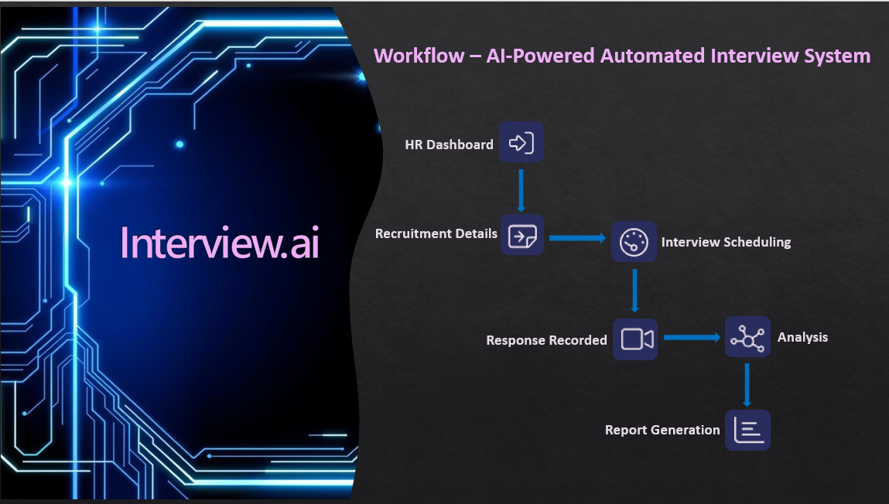

## 📦 Project: Interview.ai  
**Capstone – InnoQuest Cohort 1 @ Innovista**

- **Problem Statement**  
  Slow CV screening, scheduling delays, and inconsistent evaluations plague traditional recruitment. Interview.ai delivers fast, fair, and data‑driven candidate assessments with zero manual intervention.

- **Role**  
  Full‑Stack Developer (Next.js & FastAPI)

- **Duration**  
  Mar 2025 – Jun 2025

- **Description**  
  Interview.ai fully automates the preliminary hiring funnel—from HR job posting to candidate report generation—eliminating manual bias and bottlenecks. Key features:
  - **Seamless HR Experience**  
    Secure signup/login, intuitive dashboard, chatbot guidance, one‑click job posting.  
  - **Automated Interview Scheduling**  
    Unique 48 hr links sent to candidates.  
  - **Response Recording**  
    Dynamic Q&A based on job + profile, with auto‑saved video.  
  - **Analysis & Scoring**  
    OCEAN personality + technical‑answer accuracy → composite score.  
  - **Instant Report Generation**  
    Download full CSV with candidate details & scores in one click.

- **Demo Video**  
  [▶️ Watch Demo](https://drive.google.com/file/d/1A7gnQlM_ntab3yC1et4oLXdA0KSLbFwI/view)

## 📄 Workflow Diagram  

  

